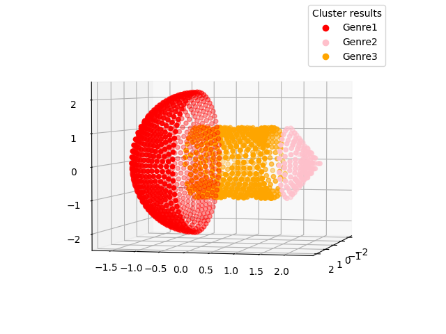

# 3D-Point-Cloud-Segmentation
Display of a simple 3D point cloud segmentation model

We mainly adopt three algorithms: 'KMeans++, Delaunay, and DBSCAN', hoping to be helpful to everyone

## Effect display

# Appendix
The code for this article is original. If used, please indicate the source.
